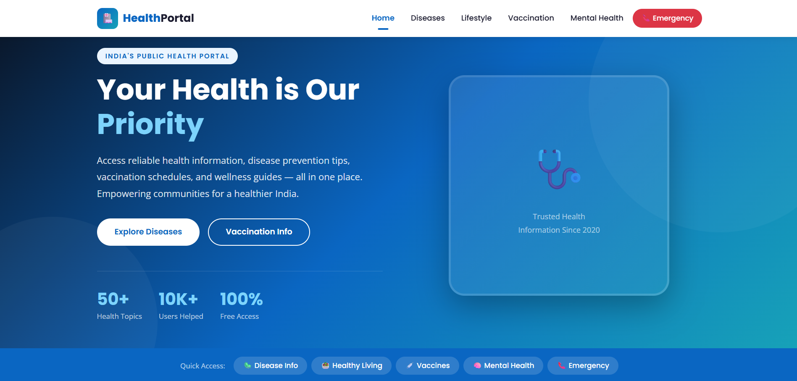
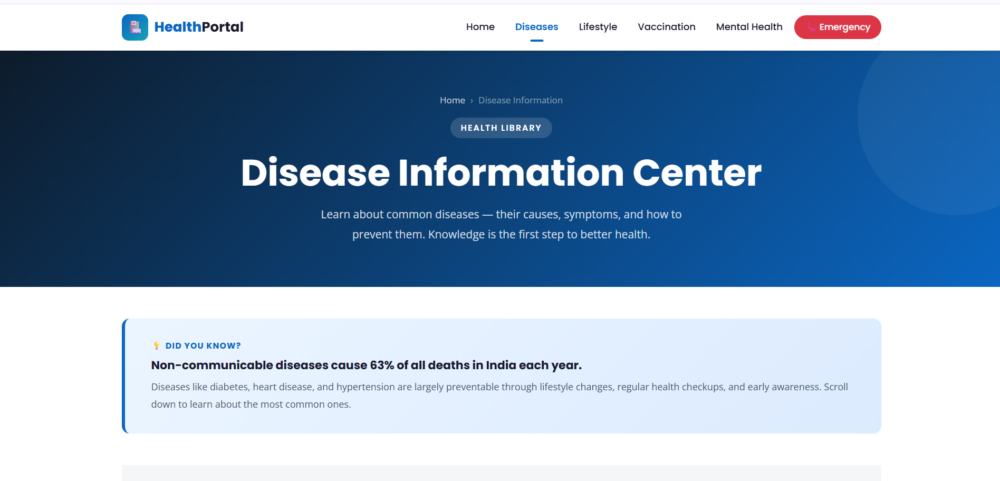
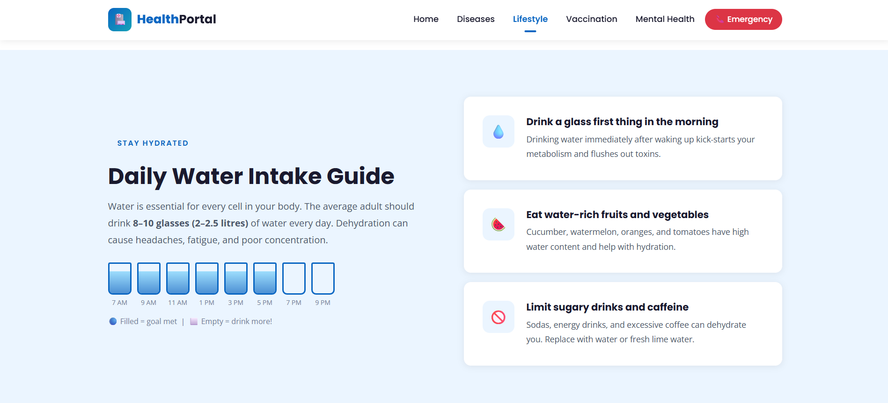
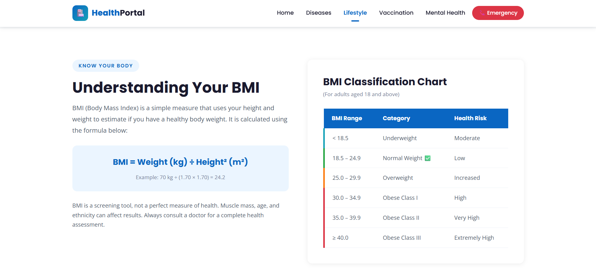

# HealthPortal
A responsive healthcare information portal featuring disease awareness, vaccination guidance, lifestyle tips, and mental wellness resources built with pure HTML5 and CSS3.

### Live demo Link
https://prasanna-rajs.github.io/HealthPortal/

# Features

- Responsive healthcare-themed UI
- Disease information and prevention tips
- Lifestyle and wellness guidance
- BMI awareness section
- Vaccination awareness page
- Mental health information section
- Emergency access button
- Clean navigation and modern card layouts

# Technologies Used

- HTML5
- CSS3
- Flexbox
- Responsive Design
- Google Fonts

# Screenshots

### Homepage 
### Modern healthcare landing page with navigation and quick-access sections.

### Disease Information
### Interactive disease cards displaying symptoms and prevention tips.

### Life style guide
### Daily hydration and healthy living recommendations.

### BMI section
BMI classification chart with educational health information.

### Through this project, I practiced:

- Structuring multi-page websites
- Building responsive layouts
- Using Flexbox for alignment
- Creating reusable UI sections
- Designing modern card components
- Improving UI/UX styling skills
- Organizing frontend project files

